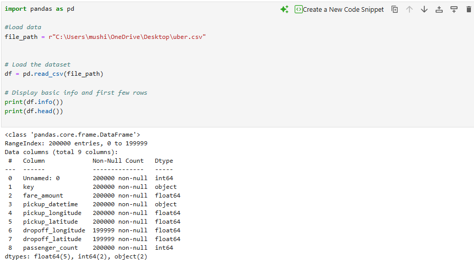
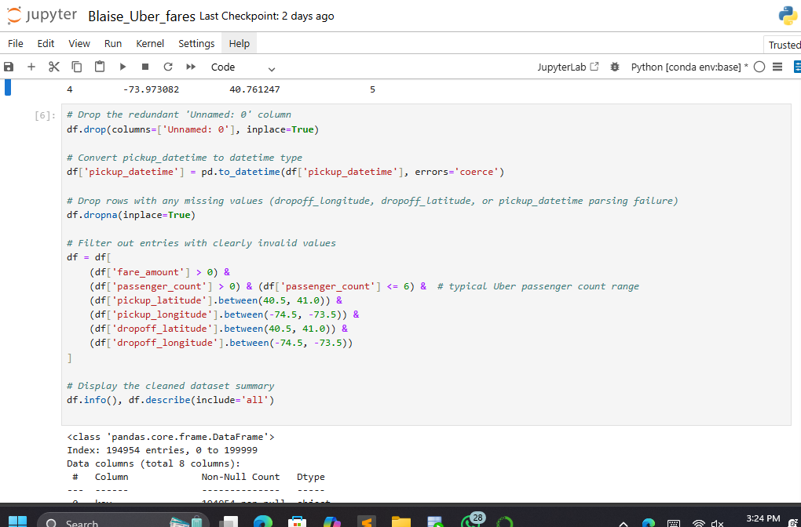
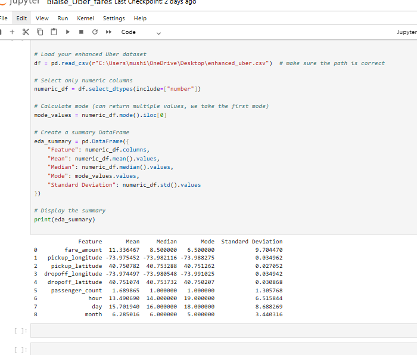
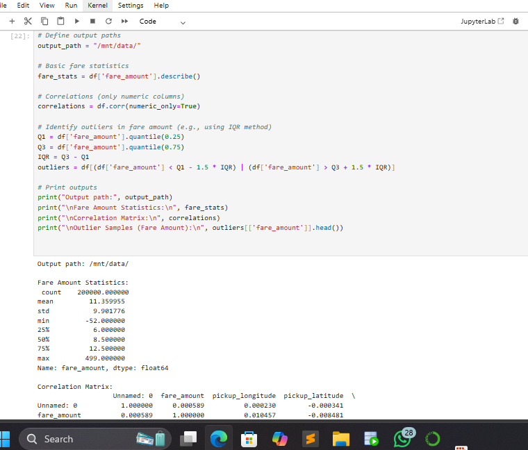
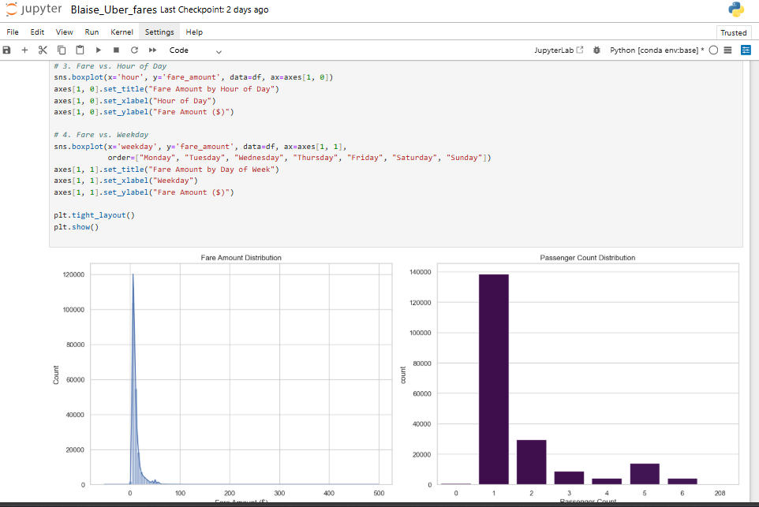
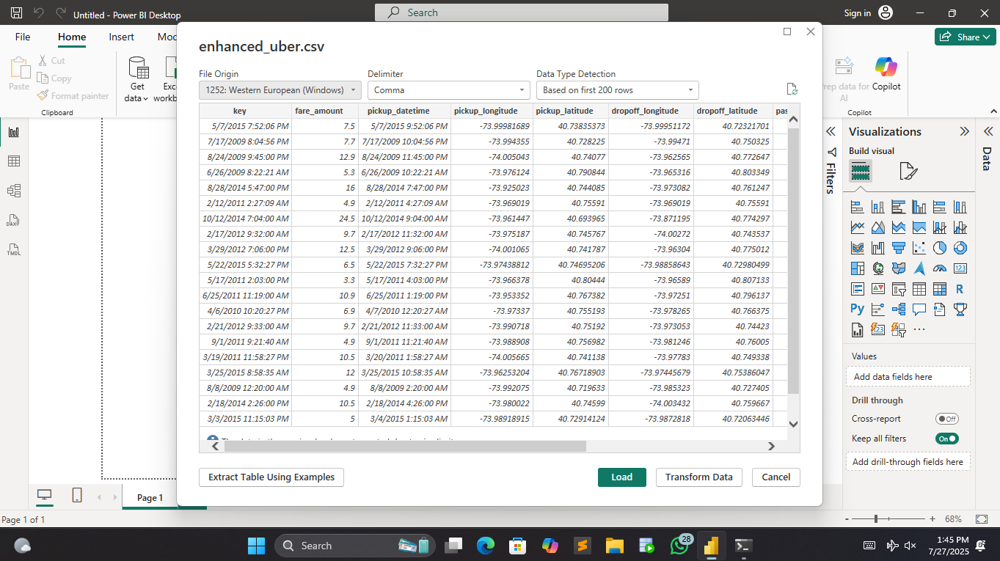
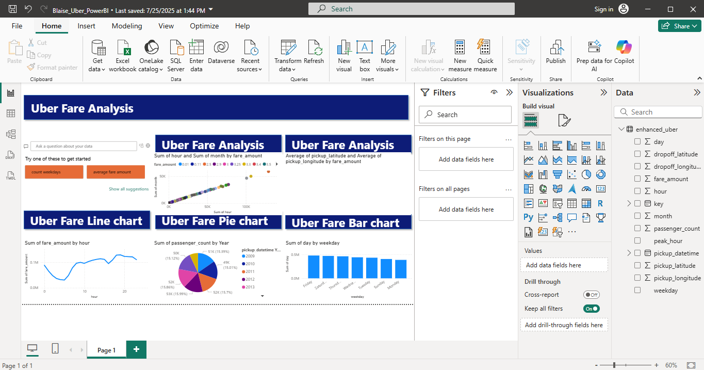

# -Uber-Fares-Dataset-Analysis-using-Power-BI

## Course: Introduction to Big Data Analytics – INSY 8413
## Instructor: Eric Maniraguha
## Student Name: Mushimiyumukiza Blaise
## Student ID: 26229
## 🔍 Objective
Analyze the Uber Fares Dataset to uncover insights into fare trends, ride patterns, and operational metrics. Develop an interactive **Power BI Dashboard** and document findings in a comprehensive analytical report.

---

## 🗃️ Dataset Information

- **Source**: [Kaggle - Uber Fares Dataset](https://www.kaggle.com/)
- **Size**: 200,000 records

## 🧰 Tools Used

- **Python (Pandas, Seaborn, Matplotlib)** – for data cleaning, EDA, and feature engineering  
- **Power BI Desktop** – for visualization and dashboard development  
- **GitHub** – for project versioning and documentation

---

## 🧼 1. Data Loading and cleaning
tabase

**Performed using Python:**
- Removed missing values in key columns (`fare_amount`, `pickup_datetime`)
- Converted `pickup_datetime` to proper `datetime` format
- Removed obvious outliers (e.g., negative fares)
- Exported the cleaned file as: `uber_cleaned_enhanced.csv`
  tabase

---

## 🧪 2. Exploratory Data Analysis (EDA)

### 🔹 Summary Statistics (Fare)
| Metric       | Value   |
|--------------|---------|
| Count        | 199,999 |
| Mean         | $11.36  |
| Median       | $8.50   |
| Min          | -$52.00 |
| Max          | $499.00 |
tabase

tabase

### 🔹 Correlations
| Variables           | Correlation |
|---------------------|-------------|
| Fare vs Hour        | -0.021      |
| Fare vs Month       | +0.024      |
tabase

### 🔹 Visualizations

---

## 🧠 3. Feature Engineering

Created new variables:
- `hour`, `day`, `month`, `day_of_week`
- `peak_hour`: Peak = 7–9 AM, 5–7 PM

---

## 📈 4. Power BI Dashboard
### Loading Data

### ✅ Dashboard Includes:
- Fare amount histogram
- Ride patterns by hour, day, and month
- Peak vs Off-peak analysis
- Time series trends of fare amounts
- Consistent formatting and business-focused insights
  tabase

📁 **Power BI File**: [`Uber_Analytics.pbix`](./Uber_Analytics.pbix)

## 📝 5. Key Insights

- Majority of fares are between **$5–$15**
- Peak hours show slightly **higher average fares**
- Most rides occur between **6 PM and 9 PM**
- **Fridays and weekends** have higher traffic volume

---

## 💡 6. Recommendations

- Increase driver availability during **evening hours and weekends**
- Optimize pricing during **peak hours**
- Use time-based insights to enhance **marketing campaigns**
